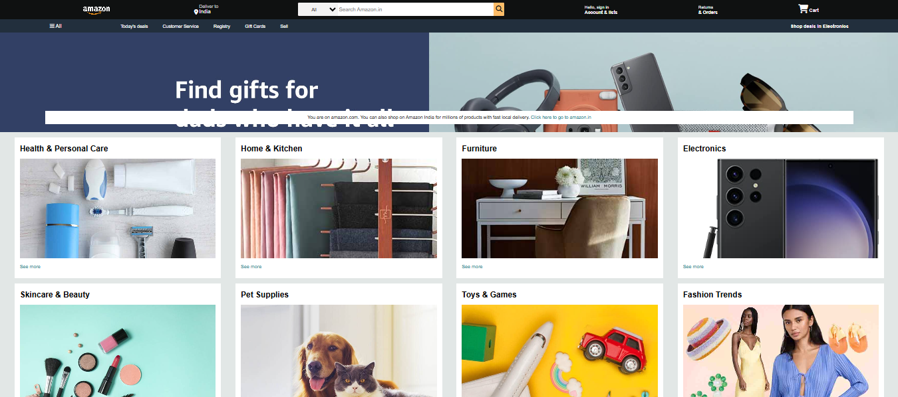

# amazon-frontend
 A responsive frontend clone of the Amazon website, built using HTML and CSS. This project replicates the layout and design of the Amazon homepage with a clean and structured UI.
 
# 🚀 Features :

🎨 Fully responsive design for different screen sizes

📌 Accurate layout & styling similar to Amazon

🔥 Hover effects and animations for better UI/UX

📄 Clean and well-structured HTML & CSS code

# 🛠️ Technologies Used :

HTML - Structure of the webpage

CSS - Styling and layout

# 📸 Preview :

# 📂 Installation & Usage :
Clone the repository -
git clone https://github.com/yashsri2802/amazon-clone.git

Navigate to the project folder -
cd amazon-clone

Open index.html in your browser

Or use Live Server in VS Code for a better development experience.

# 📌 Future Enhancements :

🛍️ Add JavaScript for interactive functionality

🌙 Dark mode toggle

🛒 Cart and product listing page

📂 Sidebar for easy navigation

# 💡 Contributing :

Feel free to fork this repository and contribute improvements!

# 📜 License :
This project is licensed under the MIT License.
